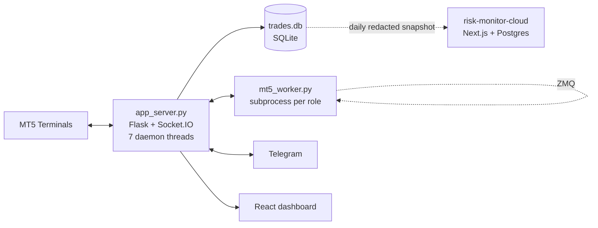

# Risk Monitor

**A real-time, multi-account MT5 trading risk dashboard and trade-copier with an
independent safety net that catches silent failures other copiers can't.**

Built to run unattended, 24/5, across multiple MetaTrader 5 terminals — polling
account state twice a second, mirroring trades between accounts over ZeroMQ,
enforcing prop-firm news-blackout rules, and alerting a human on Telegram the
moment anything drifts from expected.

Full technical write-up: **[docs/ARCHITECTURE.md](docs/ARCHITECTURE.md)**
(12 diagrams — process topology, thread model, data flows, schemas, failure
modes). Companion project: **[risk-monitor-cloud](https://github.com/Shamilawa/risk-monitor-cloud)**,
a read-only analytics dashboard fed by a daily redacted snapshot of this app's
database.

---

## Why this project is worth a look

Most "trading dashboard" repos are a poller and a chart. This one solves the
harder problems that only show up once real money and unattended execution are
on the table:

- **Trade copying is fire-and-forget by design — so failures are caught by a
  second, independent system, not assumed away.** The copier pushes trade
  signals over ZeroMQ PUSH/PUB with no acknowledgement path. Rather than trust
  that every consumer received and filled every signal, a background
  reconciler diffs the provider's live open positions against every
  consumer's every 15 seconds — an exact set difference that needs no
  cooperation from a worker that has crashed, lost its subscription, or never
  received the signal at all. A second layer (the execution ledger) explains
  *why* once the first layer catches *what*. **No LLM or heuristic scoring
  anywhere in the detection path** — a monitor whose failure mode is silence
  cannot afford to be probabilistic.
- **Fails closed, not open, when it matters.** If the news-calendar feed can't
  be reached after three attempts, every prop-firm-flagged account is blocked
  from *all* trade copying — open, close, and modify — until a human enters
  today's events manually. The default assumption when the safety mechanism
  itself breaks is "block", not "proceed and hope."
- **Runs seven concurrent daemon threads and a fleet of supervised
  subprocesses on one Python process**, each with a distinct responsibility
  and none blocking the others: a 0.5s account poller, a ZMQ router, a
  process supervisor that reconciles desired vs. actual copier subprocesses
  every 3s (and tells a crash apart from an intentional config change), a
  15s reconciler, a news-calendar fetcher, a Telegram long-poller, and a
  journal sync — all sharing one SQLite file safely.
- **Idempotent schema migrations that don't assume a clean database.** Every
  column addition is a guarded `ALTER TABLE` against a live, already-populated
  DB that's checked into git. Several hot paths read the schema back
  positionally with cascading fallback tiers for older column sets — a
  constraint that shapes how every migration has to be written, documented
  inline in the codebase.
- **A UI that survives being backgrounded for hours.** The frontend
  deliberately disconnects its WebSocket when the tab is hidden and coalesces
  any backlog into at most one React re-render per animation frame on
  reconnect, instead of replaying a queue of stale state updates one at a
  time and freezing the tab.
- **Deploys without ever risking the thing that matters.** The release
  pipeline builds a zip that is *structurally incapable* of overwriting
  `trades.db`, `.env`, or the copier's ticket-map state on the target
  machine — those files are never staged into the archive in the first
  place, not merely excluded by convention.

---

## What it does

- Connects to any number of local **MetaTrader 5** terminals by install path
  and polls each one concurrently for equity, drawdown, margin and open
  positions.
- Streams that state to a React dashboard over Socket.IO in real time, with
  per-instance and portfolio-level views.
- **Copies trades** between a provider account and any number of consumer
  accounts, with three sizing modes (fixed lot / volume multiplier / dynamic
  USD-risk sizing), symbol remapping, and retry logic that distinguishes
  transient broker errors from configuration errors worth reporting instead.
- **Detects and alerts on copier failures** a human would otherwise never see
  — a rejected order, a crashed worker, an orphaned mirror position — via
  Telegram messages with inline **Retry** / **Close** buttons that call back
  into the running app.
- **Blocks trading around high-impact news** for prop-firm-flagged accounts,
  sourced from a public economic calendar and fail-closed if that calendar is
  unreachable.
- Tracks drawdown limits, profit ceilings and profit-lock targets per
  account, with automatic position closing and Telegram approval flows.
- Builds a full **trading journal** from MT5's own deal history — equity
  curves, calendar heatmaps, MAE/MFE backfill, risk-adjusted stats, Monte
  Carlo projections — independently reconciled against the broker's raw
  history by a standalone verification script.
- Pushes a redacted daily snapshot to a cloud Postgres database for
  browser-based review from anywhere, with nothing that could move an order
  ever leaving the machine.

## Architecture at a glance



See **[docs/ARCHITECTURE.md](docs/ARCHITECTURE.md)** for the full picture:
system context, thread-by-thread breakdown, the copier's two-layer detection
system, SQLite and Postgres schemas as ER diagrams, the complete HTTP API
catalog, and a table of concrete failure modes mapped to how the system
responds to each.

## Tech stack

| Layer | Technology |
|---|---|
| Backend | Python · Flask · Flask-SocketIO · `MetaTrader5` package · ZeroMQ (`pyzmq`) |
| Frontend | React 19 · TypeScript · Vite · Zustand · TanStack Query · Chart.js · `socket.io-client` |
| Data | SQLite (WAL-safe, checked into git) |
| Messaging | ZeroMQ PUSH/PUB router, Telegram Bot API (long-polling) |
| Ops | PowerShell release pipeline, Windows Task Scheduler for cloud sync |

## Project layout

```
mt5_bridge/
├── app_server.py        # Flask + Socket.IO app: routes, DB, 7 background threads
├── mt5_worker.py         # PROVIDER/CONSUMER copier subprocess
├── copier_monitor.py     # ledger + reconciler + incident engine (the safety net)
├── news_calendar.py      # prop-firm news-blackout logic
├── issue_log.py          # append-only human-readable incident log
├── cloud_sync.py         # redacted snapshot → risk-monitor-cloud
├── reconcile_journal.py  # independent journal acceptance test
├── frontend/              # Vite + React 19 dashboard
└── deploy/                # zip-based release scripts (dev → VPS)
```

## Running it

Requires Windows, with each MT5 terminal installed, logged in, and
**Tools → Options → Expert Advisors → "Allow algorithmic trading"** enabled.

```bash
# Frontend
cd mt5_bridge/frontend
npm install
npm run build      # required — Flask serves this build, not the dev server

# Backend
cd mt5_bridge
pip install -r requirements.txt
python app_server.py     # serves http://127.0.0.1:5000, auto-opens the browser
```

Full setup, configuration and deploy details in
**[docs/ARCHITECTURE.md § Configuration reference](docs/ARCHITECTURE.md#18-configuration-reference)**
and **[§ Build & deployment pipeline](docs/ARCHITECTURE.md#19-build--deployment-pipeline)**.

---

Built and maintained solo — architecture, backend, frontend, and ops.
