# Architecture — Risk Monitor & Risk Monitor Cloud

Complete architecture reference for the two-repository system:

| Repo | Path | Role |
|---|---|---|
| **risk_monitor** | `f:\Coding\risk_monitor` | Windows-only local/VPS app. Talks to MT5 terminals, streams live risk, copies trades, alerts via Telegram, owns the SQLite source of truth. |
| **risk-monitor-cloud** | `f:\Coding\risk-monitor-cloud` | Next.js + Postgres app on Vercel. Receives a redacted daily snapshot and renders a read-only myfxbook-style analytics dashboard. |

The boundary between them is **one-directional and snapshot-based**: the local app pushes, the cloud never calls back, never writes to MT5, and never sees anything that could move an order.

---

## Table of contents

1. [System context](#1-system-context)
2. [Deployment & process topology](#2-deployment--process-topology)
3. [Local backend: thread model](#3-local-backend-thread-model)
4. [Local backend: module map](#4-local-backend-module-map)
5. [Data flow — live risk polling](#5-data-flow--live-risk-polling)
6. [Data flow — trade copying (ZeroMQ)](#6-data-flow--trade-copying-zeromq)
7. [Copier safety net — ledger, reconciler, incidents](#7-copier-safety-net--ledger-reconciler-incidents)
8. [News blackout (prop-firm protection)](#8-news-blackout-prop-firm-protection)
9. [Telegram control plane](#9-telegram-control-plane)
10. [Persistence — SQLite schema](#10-persistence--sqlite-schema)
11. [Trading-log / journal sync pipeline](#11-trading-log--journal-sync-pipeline)
12. [Local frontend architecture](#12-local-frontend-architecture)
13. [Cloud sync boundary](#13-cloud-sync-boundary)
14. [Cloud app architecture](#14-cloud-app-architecture)
15. [Cloud Postgres schema](#15-cloud-postgres-schema)
16. [Ports, sockets & files](#16-ports-sockets--files)
17. [HTTP API catalog](#17-http-api-catalog)
18. [Configuration reference](#18-configuration-reference)
19. [Build & deployment pipeline](#19-build--deployment-pipeline)
20. [Design invariants & failure modes](#20-design-invariants--failure-modes)
21. [Legacy / dead code & known drift](#21-legacy--dead-code--known-drift)

---

## 1. System context

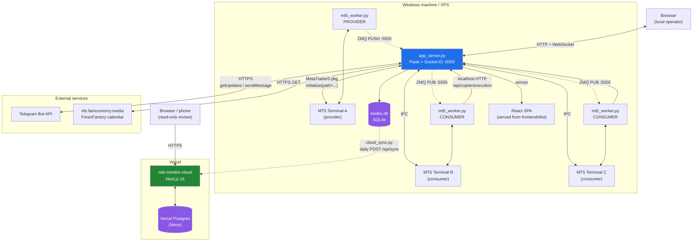

**Key facts**

- Every MT5 terminal is addressed purely by its **install path**. `mt5.initialize(path=...)` is the only mechanism that targets a specific terminal; there is no per-terminal port or login in the app.
- The `MetaTrader5` Python package is single-connection per process. `app_server.py` therefore serialises all its MT5 access behind a global `mt5_lock` and re-initialises per instance inside `fetch_instance_data`, while each `mt5_worker.py` subprocess owns exactly one terminal for its lifetime.
- The cloud app is **read-only**. Its only write path is the ingestion endpoint, and that only ever receives data from the Windows side.

---

## 2. Deployment & process topology

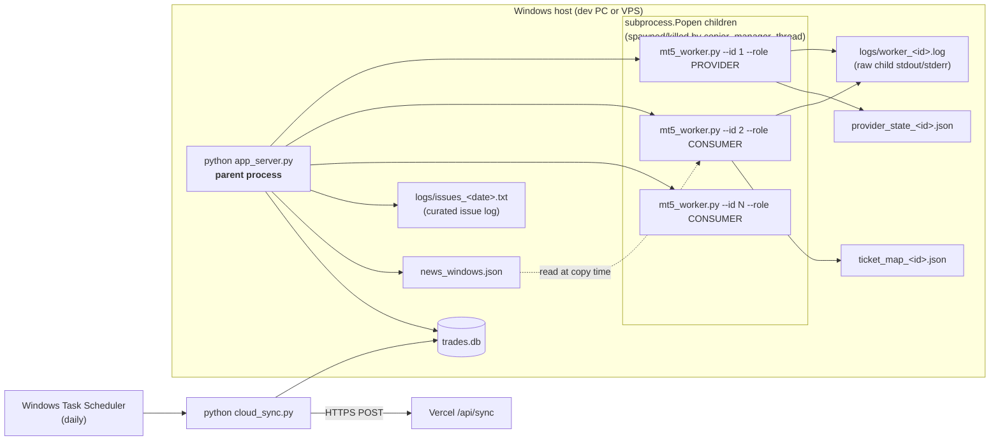

**Process rules**

- `app_server.py` is the only writer of `logs/issues_*.txt` — workers report over localhost HTTP instead, because two Windows processes appending to one file interleave and corrupt lines.
- Workers are **stateless across restarts except for JSON sidecar files**: `ticket_map_<id>.json` (provider ticket → local ticket) and `provider_state_<id>.json` (seen tickets, last deal time). These survive a crash so a restarted worker doesn't duplicate or orphan positions.
- `news_windows.json` is the IPC channel for the news calendar: `app_server.py` writes it once a day, every consumer worker reads it at trade-copy time. Chosen deliberately over shared memory because the processes are unrelated.

---

## 3. Local backend: thread model

`main()` in [app_server.py](../mt5_bridge/app_server.py) starts **seven daemon threads** plus the Flask/Socket.IO server.

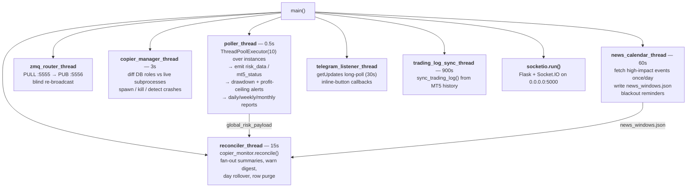

| Thread | Interval | Shared state it touches |
|---|---|---|
| `poller_thread` | 0.5 s | writes `global_risk_payload`, `global_mt5_status`; reads `instances`; writes `daily_equity_baseline`, `risk_snapshots` |
| `zmq_router_thread` | blocking recv | none (pure relay) |
| `copier_manager_thread` | 3 s | `copier_workers` dict; reads `instances` |
| `reconciler_thread` | 15 s | reads `global_risk_payload` (no extra MT5 calls); writes `copier_incidents` |
| `news_calendar_thread` | 60 s | writes `news_windows.json` |
| `telegram_listener_thread` | 30 s long-poll | `profit_lock_state`, `global_settings.telegram_last_update_id` |
| `trading_log_sync_thread` | 900 s | `trading_log`, `balance_operations`, `trading_log_sync_state` |

> **Why the reconciler reuses the poller's snapshot:** MT5 IPC calls are serialised behind one lock and are the app's scarcest resource. Reconciliation runs on `global_risk_payload`, so it costs zero additional round-trips.

---

## 4. Local backend: module map

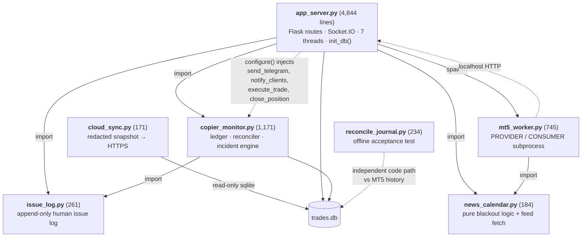

**Dependency-inversion detail:** `copier_monitor` never imports `app_server`. At startup `main()` calls `copier_monitor.configure(send_telegram=…, send_telegram_buttons=…, notify_clients=…, execute_trade=…, close_position=…)`, injecting the five helpers it needs. This keeps the module free of a circular import and independently testable.

**`reconcile_journal.py`** is the acceptance test for the journal: it recomputes closed-position count, net P&L, gross profit/loss and commission/swap totals straight from `history_deals_get` via an *independent* code path, then diffs against `trading_log`. Exit code 0 = reconciles, 1 = drift.

---

## 5. Data flow — live risk polling

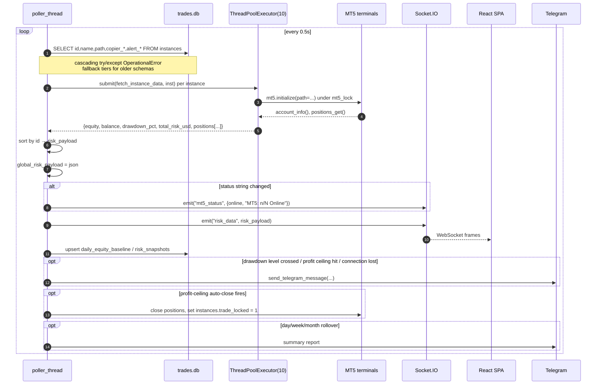

**Per-instance payload** (`fetch_instance_data`) carries: `id, name, group_name, balance, equity, margin_level, total_risk_usd, drawdown_pct, copier_role, copier_risk_type, copier_fixed_lot, copier_risk_usd, copier_risk_multiplier, account_type, trade_locked, positions[]`. An instance whose `mt5.initialize()` fails returns `None` and is simply absent from the payload — that absence is what drives the `n/N Online` status text and the connection-loss alert.

---

## 6. Data flow — trade copying (ZeroMQ)

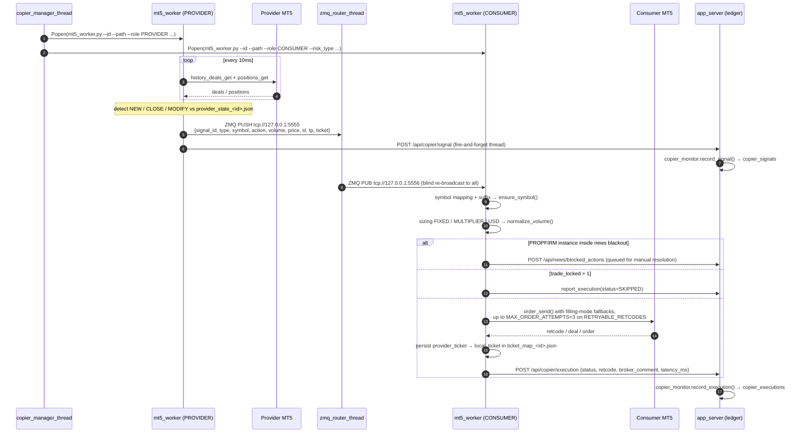

**Sizing modes** (`instances.copier_risk_type`):

| Mode | Column | Behaviour |
|---|---|---|
| `FIXED` | `copier_fixed_lot` | Always the same lot size, regardless of provider volume. |
| `MULTIPLIER` | `copier_risk_multiplier` | `provider_volume × multiplier`. |
| `USD` | `copier_risk_usd` | Dynamic: sizes the lot so the SL distance equals the configured dollar risk. |

Every result passes through `normalize_volume(symbol, volume)`, which clamps to the symbol's min/max and snaps to its volume step — otherwise the single most common source of `10014 INVALID_VOLUME` rejections.

**Retry policy:** `RETRYABLE_RETCODES = {10004, 10011, 10012, 10020, 10021, 10024}` — transient pricing/queue conditions only. Configuration failures (invalid volume, no money, invalid stops) fail identically on retry, so they are reported instead of retried.

**Replay on restart:** a restarting consumer calls `fetch_missed_signals()` and replays only signals newer than `REPLAY_WINDOW_SEC = 120`. Anything older is left to the reconciler to flag rather than acted on unattended — entering a trade minutes late is its own risk.

---

## 7. Copier safety net — ledger, reconciler, incidents

The copier is fire-and-forget over ZMQ: the provider pushes, consumers act, nothing reports back by protocol. [copier_monitor.py](../mt5_bridge/copier_monitor.py) adds **two independent detection layers** so a failed copy can never be silent.

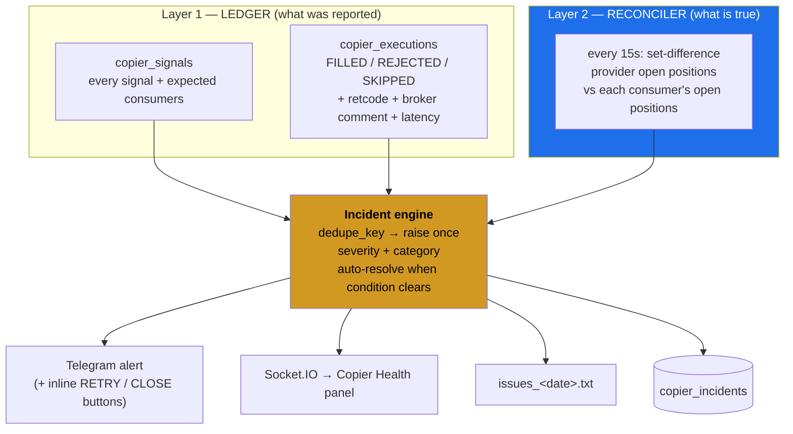

> Layer 2 is the real safety net — it needs no cooperation from the workers at all, so it still catches a consumer that crashed, lost its ZMQ subscription, or never received the signal. Layer 1 explains what Layer 2 finds.
>
> **No LLM anywhere in the detection path.** Ground truth here is an exact set difference; a monitor whose failure mode is silence must not have a probabilistic detector.

### Timing constants (all in `copier_monitor.py`)

| Constant | Value | Purpose |
|---|---|---|
| `COPY_GRACE_SEC` | 25 s | A provider position must be visible this long before a missing mirror counts as failure rather than fill latency. |
| `CLOSE_GRACE_SEC` | 30 s | How long after the provider goes flat before a still-open mirror is an alarm. |
| `CONSUMER_SETTLE_SEC` | 30 s | A consumer must be continuously online this long before being judged — stops a reconnect producing an alarm burst. |
| `FANOUT_SUMMARY_SEC` | 10 s | Wait before summarising a signal's fan-out, so slow consumers land in the same message. |
| `STORM_LIMIT` / `STORM_WINDOW_SEC` | 5 / 60 s | More than 5 CRITICALs for one instance in 60 s collapses into a single "this consumer is failing everything" alert. |
| `COPIER_MAGIC` | `777888` | Magic number stamped on every mirrored order, so copier positions are distinguishable from manual ones. |
| `RETENTION_DAYS` (issue_log) | 90 | Issue-log file retention. |

### Incident lifecycle

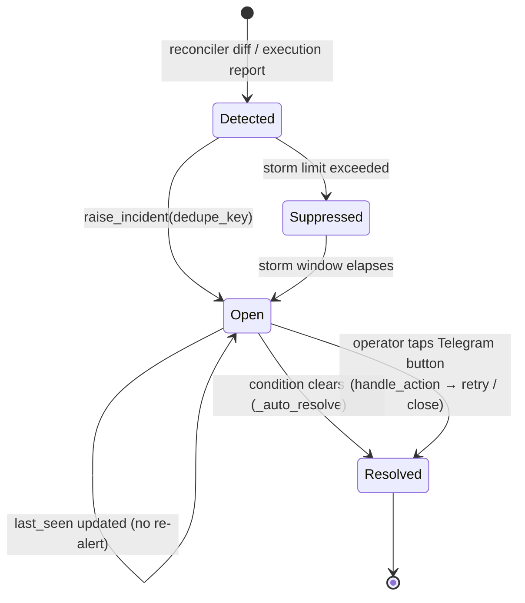

`dedupe_key` is deliberately **not** unique in the table — the same condition may legitimately recur after being resolved. Open-incident lookups filter on `status` instead.

### Worker health

`copier_manager_thread` distinguishes a **config change** (kill + respawn, expected) from a **crash** (`process.poll() is not None` while still in `desired`). A crash triggers `copier_monitor.report_worker_restart()` with the last 6 lines of `logs/worker_<id>.log` attached, so the alert carries the actual error. A worker that stays up 300 s after a restart history reports `report_worker_healthy()`.

---

## 8. News blackout (prop-firm protection)

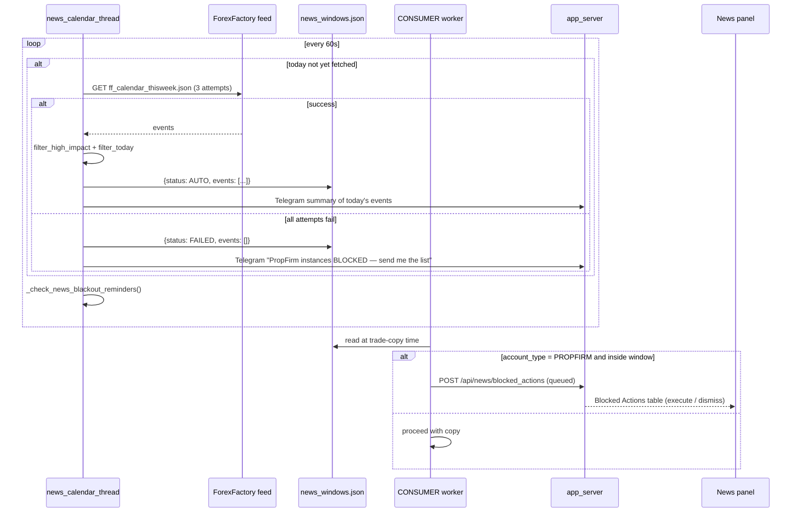

- Blackout window is per-instance: `news_block_before_min` / `news_block_after_min` (default 2.0 min each side).
- **Fail-closed**: if the calendar can't be fetched, PROPFIRM instances are blocked from *all* copying (open/modify/close) until the operator enters events manually via `POST /api/news/manual`. Failing open here would silently violate the prop firm's rules.
- `CURRENCY_ALIASES` maps index tickers to the currency whose news restricts them (`US30`/`NAS100`/`SPX500` → USD, `UK100` → GBP, `GER40` → EUR, `JPN225` → JPY, `AUS200` → AUD).
- Feed timestamps carry an explicit UTC offset and are converted to epoch immediately, so the host's timezone setting never matters again — only its clock accuracy.

---

## 9. Telegram control plane

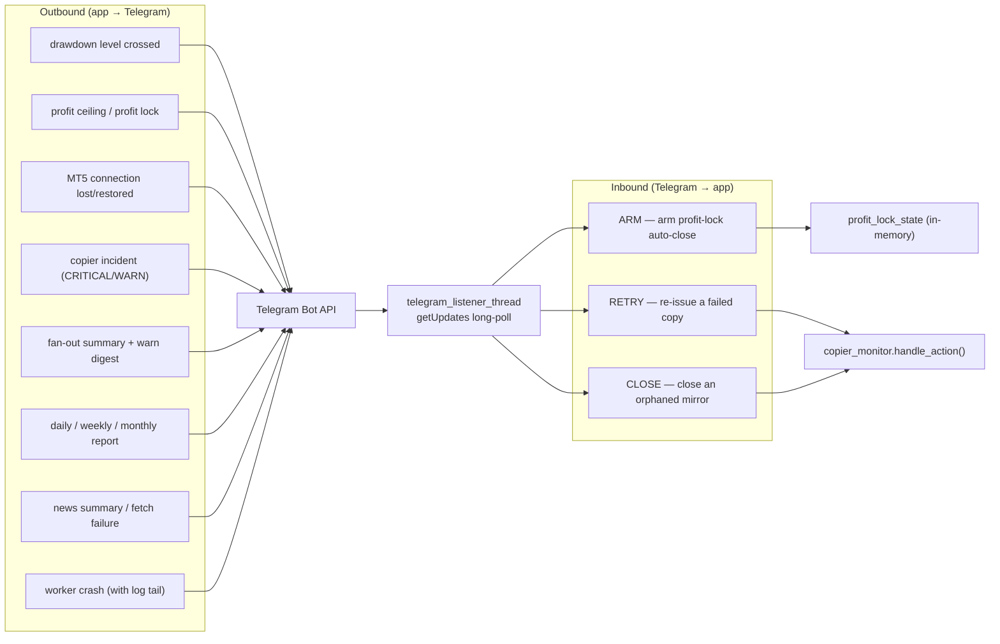

**Design choices**

- **Long-polling, not a webhook** — works behind the VPS's NAT with no public URL or HTTPS setup. `telegram_delete_webhook()` runs on startup because a webhook set by any other tool would silently block `getUpdates` forever.
- **Chat-ID authorisation** — every callback's originating chat is compared against `TELEGRAM_CHAT_ID`; anything else is logged and dropped.
- **Single-use tokens** — the ARM button carries `arm:<instance_id>:<token>`; the token must match the current `profit_lock_state[inst_id]` entry and is cleared on use, so a replayed or stale tap answers "expired or already handled".
- `telegram_last_update_id` is persisted in `global_settings` so a restart doesn't replay old button taps.
- `send_telegram_message()` silently no-ops when credentials are unset — Telegram is never on a critical path.

---

## 10. Persistence — SQLite schema

Single file: `mt5_bridge/trades.db` (**tracked in git** — schema-breaking changes need care, and you cannot assume a clean DB).

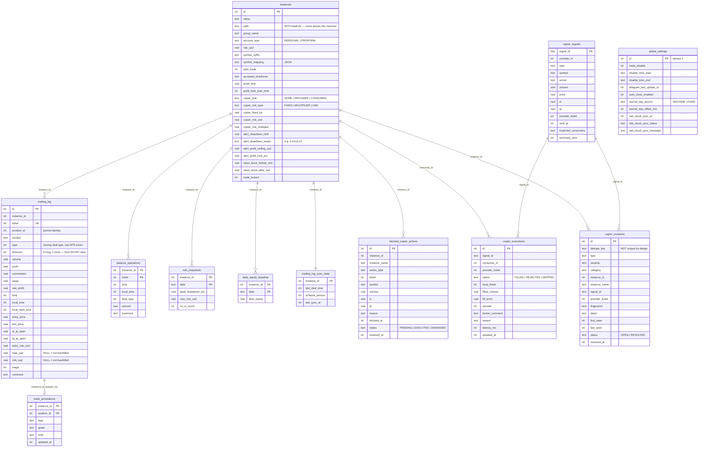

### Indexes

```
idx_trading_log_position   ON trading_log (instance_id, position_id)
idx_trading_log_close      ON trading_log (instance_id, local_time)
idx_balance_ops_time       ON balance_operations (instance_id, local_time)
idx_signals_sent           ON copier_signals (sent_at)
idx_exec_pticket           ON copier_executions (provider_ticket, consumer_id)
idx_incidents_open         ON copier_incidents (dedupe_key, status)
```

### Migration pattern

All schema evolution happens inline in `init_db()`:

```python
try:
    c.execute("ALTER TABLE instances ADD COLUMN new_col TYPE DEFAULT x")
except sqlite3.OperationalError:
    pass
```

Two consequences you must respect when changing the schema:

1. **Positional SELECTs.** Several hot paths (`poller_thread`, `api_instances`, `copier_manager_thread`) read columns positionally with *cascading* `try/except OperationalError` fallback tiers for older column sets. Adding a column mid-tuple breaks every index after it — at **runtime**, not import time. That's why `alert_daily_profit_target` was migrated with `RENAME COLUMN` (keeping its tuple position) rather than dropped and re-added, and why `name` was appended *last* to the copier-manager SELECT.
2. **`ADD COLUMN` backfills NULL, not the DEFAULT.** Single-row settings need an explicit follow-up `UPDATE` — see `journal_day_anchor`.

### Key modelling decisions

| Decision | Why |
|---|---|
| `trading_log` is keyed on **position**, not deal | A scale-out closes in several OUT deals. The old per-deal sync gave each row the whole position's summed P&L, multiplying that trade's profit by its number of partial exits. |
| `direction` comes from the **ENTRY** deal | The closing deal's `type` is inverted relative to the position (a long closes with a SELL deal), so `type` alone can't be read directly. |
| Annotations live in their **own table** keyed on `(instance_id, position_id)` | `sync_trading_log()` may delete and rebuild `trading_log` rows at any time; `trading_log.id` is not stable across a resync, so nothing user-authored may ever be keyed to it. |
| `balance_operations` is captured and subtracted out | Without it a $5,000 deposit looks like a 40% daily return and every risk-adjusted ratio on top of it is garbage. |
| `mae_usd`/`mfe_usd` are **nullable** | `NULL` ("not backfilled yet") must stay distinguishable from `0.0` ("never went against you"). |
| `sl_at_open` / `entry_risk_usd` stored per trade | Lets "trades without SL" and "max risk exposed" be derived from complete broker history instead of live polling snapshots, which silently miss any trade not caught mid-open by a poll. |
| `trading_log_sync_state.schema_version` | Forces exactly one full rebuild when an existing DB first runs the position-aggregated sync, so pre-existing multi-counted rows are replaced rather than merged into. |

### The "trading day" definition

`global_settings.journal_day_anchor` gives **one** definition used everywhere (daily P&L, calendar, hour/weekday breakdowns, review dates, risk snapshots), read via `_journal_day_config()`:

- `MACHINE` (default) — this computer's local timezone, which is also the frame the frontend renders in, so the two agree by construction.
- `FIXED` — uses `journal_day_offset_min`.

Exception: the **issue log** is keyed on local dates unconditionally, because it's a human artifact and "what broke on Tuesday" means the local Tuesday.

---

## 11. Trading-log / journal sync pipeline

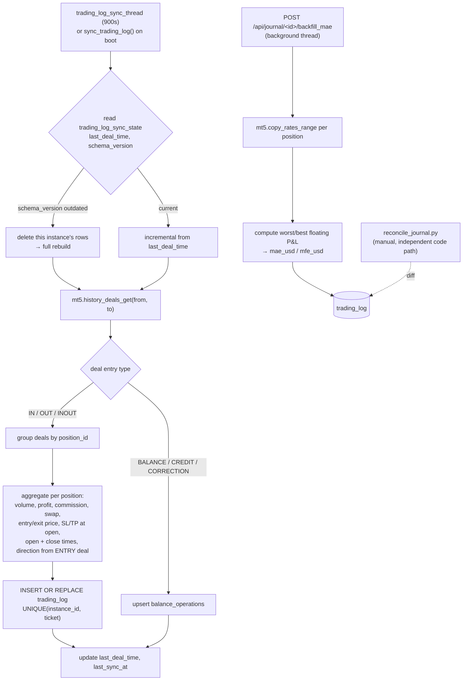

The journal API surface built on top of this (`/api/journal/<id>/…`): `summary`, `equity`, `breakdown`, `calendar`, `trades`, `distribution`, `riskadjusted`, `montecarlo`, `filters`, `annotation`, `backfill_mae`, `backfill_status`.

---

## 12. Local frontend architecture

Vite + React 19 + TypeScript, in `mt5_bridge/frontend/`. Styled with the **terminal/CRT** design system (true black, monospace, zero border-radius, bracket status tags, switchable phosphor accent).

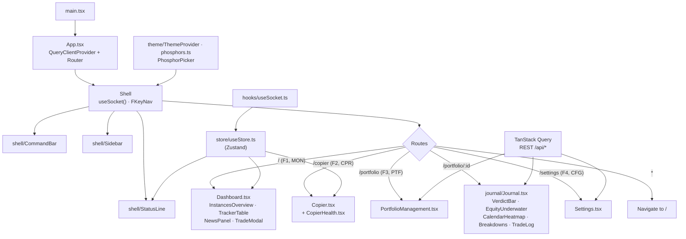

### Real-time transport

`useSocket.ts` is the **only** place the frontend talks to the backend in real time. It subscribes to three Socket.IO events:

| Event | Payload | Store target |
|---|---|---|
| `mt5_status` | `{online, text}` | `setMt5Status` |
| `risk_data` | `Instance[]` (sorted by id) | `setInstances` + flattened `setTrackerData` |
| `log` | log line string | log buffer |

Two anti-freeze mechanisms, both deliberate:

1. **rAF coalescing.** A backgrounded/throttled tab queues socket messages; draining that backlog with one `setState` per message fires one React re-render per queued message and freezes the UI on refocus. Instead only the *latest* pending payload is kept and flushed at most once per `requestAnimationFrame`.
2. **Visibility disconnect.** The socket disconnects when the tab is hidden and reconnects on visibility, so no backlog accumulates in the first place.

`/api/stream` (Server-Sent Events) exists alongside Socket.IO as a second channel that replays `mt5_status` plus the last 100 log lines so a fresh page load isn't blank.

### Navigation

`components/shell/nav.ts` is the single source of truth for the sidebar, the F-key shortcuts (`F1`–`F4`) and the active-module code (`MON`/`CPR`/`PTF`/`CFG`) shown in the command bar.

### Production serving

`flask_app` is constructed with `static_folder`/`template_folder` pointing at `frontend/dist`, and the catch-all `serve_react` route falls back to `index.html` for client-side routing.

> **`python app_server.py` does not rebuild the frontend.** You must run `npm run build` in `frontend/` for backend-served UI changes to appear.

---

## 13. Cloud sync boundary

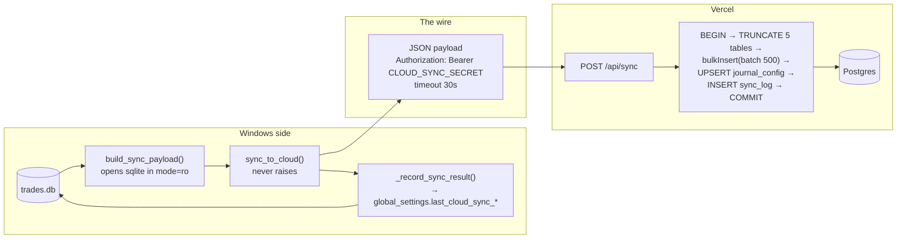

### What crosses

| Included | Redacted / excluded |
|---|---|
| `instances`: `id, name, group_name, account_type, copier_role` | `path` (leaks local filesystem layout) |
| `trading_log` (all 23 journal columns) | copier role/sizing config (`copier_risk_*`, `copier_fixed_lot`) — **controls live order sizing** |
| `trade_annotations` | alert thresholds (`alert_*`, `news_block_*`) |
| `balance_operations` | `trade_locked` |
| `risk_snapshots` | `global_settings` beyond the journal-day + auth fields |
| `journal_config` (day anchor/offset) + `auth` (username, password_hash) | everything in `copier_*` tables, `blocked_copier_actions`, logs |

### Invariants

- **Full snapshot, never a diff.** Ingestion truncates and reinserts all five tables inside one transaction, so a partial or out-of-order sync can't leave the cloud in a half-state. These tables are not meant to be written from anywhere else.
- **One code path, two triggers.** `python cloud_sync.py` (Task Scheduler) and the (planned) `POST /api/cloud_sync` route both call `sync_to_cloud()`, so a manual and a scheduled sync can never disagree about what was sent.
- **`sync_to_cloud()` never raises.** It returns `(ok, message)` and records the outcome into `global_settings.last_cloud_sync_{at,status,message}`, giving both entrypoints a single source of truth.
- **Constant-time auth.** The endpoint compares the bearer token with `crypto.timingSafeEqual` after a length check.
- **Payload shape is validated** before any DB work (`validatePayload`), returning 400 rather than a partial transaction.
- **`lib/syncTypes.ts` is a hand-maintained TypeScript mirror of `build_sync_payload()`.** The two must be changed together.

---

## 14. Cloud app architecture

Next.js 16 (App Router) + React 19 + `pg` + Recharts, deployed on Vercel.

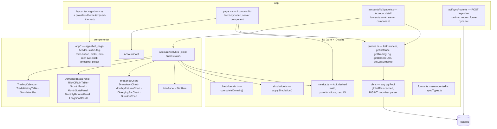

### Rendering model

Both pages are **async server components** with `export const dynamic = "force-dynamic"` — every request reads Postgres fresh (the data changes at most once a day, but staleness right after a sync would be confusing). They fetch raw rows, then hand them to the pure functions in `lib/metrics.ts`; the client components only render.

The accounts list does `Promise.all` over instances, fetching each account's trades and balance ops in parallel and computing `computeStats()` per card.

### `lib/db.ts` details

- The `Pool` is created **lazily** on first use, not at module load, so `next build`'s static analysis doesn't fail in environments where `POSTGRES_URL` isn't set yet.
- It's cached on `globalThis` so it's reused across invocations in the same serverless instance.
- Connection string resolution order: `POSTGRES_URL` → `DATABASE_URL` → `POSTGRES_PRISMA_URL`. `POSTGRES_URL` is the pooled connection, which is what serverless functions should use.
- `types.setTypeParser(20, …)` forces `BIGINT` columns to parse as JS numbers. `pg` returns them as strings by default to avoid precision loss, but every BIGINT actually stored here (`ticket`, `magic`, `position_id`, epoch seconds) fits comfortably inside a safe integer, and the metrics/UI code expects numbers.

### `lib/metrics.ts` — the analytics core

All pure, all IO-free, all operating on `TradingLogRow[]` + `BalanceOperationRow[]`:

| Group | Functions |
|---|---|
| Time helpers | `tradeCloseTime`, `tradeOpenTime`, UTC day/week/month bucketing |
| Series | `buildEquityCurve`, `buildBalanceSeries`, `buildProfitSeries`, `buildGrowthSeries`, `buildDrawdownSeries`, `downsampleBy`, `dedupeByTimestamp` |
| Core stats | `computeStats`, `computeInfoStats`, `computeAdvancedStats` |
| Risk | `computeRiskOfRuin` (gambler's-ruin approximation off the same time-weighted per-trade returns as AHPR/GHPR — needs no account balance) |
| Periods | `computeCalendarData`, `computeMonthlyStats` |
| Breakdowns | `computeProfitBySymbol`, `computeProfitByDayOfWeek`, `computeProfitByHour`, `computeDurationDistribution`, `computeLongShortSplit` |

**Balance operations are subtracted out of the return series** everywhere — deposits and withdrawals must never register as performance.

`chart-domain.ts::computeYDomain` replaces Recharts' auto-scale, so a series like Balance that never approaches $0 isn't compressed into a sliver of the chart.

### Deliberately not implemented (documented in `PROGRESS.md`, not gaps to fill silently)

- **Equity / live floating P&L** — `cloud_sync.py` only reads the offline `trades.db`; there is no live MT5 connection at sync time. Not shown, rather than faked.
- **Pips** — a pip's dollar size depends on each symbol's tick/point definition, which isn't synced. Would need `mt5.symbol_info().point` in the payload.
- **Z-Score (runs test)** — skipped rather than risk shipping a subtly-wrong formula with no ground truth to check against.
- **Millisecond close times** — MT5 exposes `time_msc`, never captured in `app_server.py`. Whole-second precision is why same-second trade clusters need a dedup step.
- **Auth** — `journal_config.username`/`password_hash` columns exist and are synced, but the pages are unauthenticated by design for now.
- **On-demand sync button** — `cloud_sync.py`'s docstring describes `POST /api/cloud_sync` + a Settings "Sync Now" button; **only the tracking columns exist**. Manual CLI and Task Scheduler are the only triggers today.

---

## 15. Cloud Postgres schema

Defined in `schema.sql`, applied once before the first sync.

```mermaid
erDiagram
    instances ||--o{ trading_log : instance_id
    instances ||--o{ trade_annotations : instance_id
    instances ||--o{ balance_operations : instance_id
    instances ||--o{ risk_snapshots : instance_id

    instances {
        int id PK
        text name
        text group_name
        text account_type
        text copier_role
    }
    trading_log {
        int instance_id PK
        bigint ticket PK
        bigint position_id
        text symbol
        int type
        int direction
        float volume
        float profit
        float commission
        float swap
        float raw_profit
        bigint time
        bigint local_time
        bigint local_start_time
        float entry_price
        float exit_price
        float sl_at_open
        float tp_at_open
        float entry_risk_usd
        float mae_usd
        float mfe_usd
        bigint magic
        text comment
    }
    trade_annotations {
        int instance_id PK
        bigint position_id PK
        text tags
        text grade
        text note
        bigint updated_at
    }
    balance_operations {
        int instance_id PK
        bigint ticket PK
        bigint time
        bigint local_time
        int deal_type
        float amount
        text comment
    }
    risk_snapshots {
        int instance_id PK
        text date PK
        float peak_drawdown_pct
        float max_risk_usd
        int no_sl_count
    }
    journal_config {
        int id PK "always 1"
        text journal_day_anchor
        int journal_day_offset_min
        text username
        text password_hash
    }
    sync_log {
        serial id PK
        timestamptz synced_at
        bigint generated_at
        jsonb row_counts
    }
```

`journal_config` is upserted (`ON CONFLICT (id) DO UPDATE`) rather than truncated, and `sync_log` is append-only — it's the debugging history of sync attempts, readable without touching the Windows box.

---

## 16. Ports, sockets & files

| Endpoint | Bind | Protocol | Purpose |
|---|---|---|---|
| `0.0.0.0:5000` | `app_server.py` | HTTP + WebSocket (Socket.IO) + SSE | REST API, real-time stream, serves `frontend/dist` |
| `tcp://127.0.0.1:5555` | `zmq_router_thread` | ZeroMQ **PULL** (bind) | Providers PUSH signals here |
| `tcp://127.0.0.1:5556` | `zmq_router_thread` | ZeroMQ **PUB** (bind) | Consumers SUB here (subscribe to `""` = everything) |
| `http://127.0.0.1:5000/api/copier/*` | workers → server | localhost HTTP | Worker → server reporting (fire-and-forget, 3 s timeout, never blocks the trading loop) |
| Vercel `/api/sync` | cloud | HTTPS POST | Snapshot ingestion |

The router is a **blind re-broadcast** — no filtering, addressing or ack. Consumers do all filtering themselves. The trade-off is simplicity at the cost of needing the reconciler as a separate safety net.

### Files written at runtime

```
mt5_bridge/
├── trades.db                     # SQLite source of truth (tracked in git)
├── news_windows.json             # daily blackout windows; app_server writes, workers read
├── ticket_map_<id>.json          # consumer: provider ticket → local ticket
├── provider_state_<id>.json      # provider: seen tickets + last deal time
└── logs/
    ├── worker_<id>.log           # raw child stdout/stderr (was previously lost to the console)
    └── issues_<date>.txt         # curated, append+flush, 90-day retention, single writer
```

`issue_log.py` appends **and flushes** on every write, because a power cut is exactly when you want the last line to have survived. All its IO is wrapped — nothing in it may ever raise into the trading path.

---

## 17. HTTP API catalog

All served by `app_server.py` on port 5000. In dev, Vite proxies `/api` to `127.0.0.1:5000` (`vite.config.ts`).

### Instances & portfolio

| Method | Path | Purpose |
|---|---|---|
| GET/POST/PUT/DELETE | `/api/instances` | Instance CRUD |
| GET | `/api/portfolio_overview` | Aggregated portfolio view |
| POST | `/api/instances/reset_profit` | Reset the profit-limit window |
| POST | `/api/instances/unlock` | Clear `trade_locked` after a profit-ceiling auto-close |
| GET | `/api/browse_file` | Server-side file picker for MT5 install paths |
| GET/POST | `/api/global_settings` | Global settings (trade-disable window, journal day anchor, auto-close) |

### Live data & trading

| Method | Path | Purpose |
|---|---|---|
| GET | `/api/stream` | SSE fallback channel (status + last 100 log lines) |
| GET | `/api/tracker` | Position tracker table |
| POST | `/api/close_all` | Close every position on an instance |
| POST | `/api/close_group` | Close a symbol/group of positions |
| POST | `/api/internal_notify` | Worker → UI toast relay |

### Copier

| Method | Path | Purpose |
|---|---|---|
| GET | `/api/copier_instances` | Copier config per instance |
| POST | `/api/copier_instances/update` | Update role / sizing / mapping |
| POST | `/api/copier/signal` | **Worker → server**: a signal went out |
| POST | `/api/copier/execution` | **Worker → server**: FILLED / REJECTED / SKIPPED + retcode |
| GET | `/api/copier/signals` | Signal ledger |
| GET | `/api/copier/incidents` | Open incidents |
| POST | `/api/copier/incidents/<id>/<action>` | Act on an incident (retry / close / resolve) |
| GET | `/api/copier/issue_log` | Curated issue log for the UI |

### Journal (`<id>` = instance id)

| Method | Path | Purpose |
|---|---|---|
| GET/POST | `/api/journal/config` | Journal-day configuration |
| GET | `/api/journal/<id>/summary` | Headline verdict stats |
| GET | `/api/journal/<id>/equity` | Equity + underwater curve |
| GET | `/api/journal/<id>/breakdown` | By symbol / hour / weekday |
| GET | `/api/journal/<id>/calendar` | Calendar heatmap buckets |
| GET | `/api/journal/<id>/trades` | Trade log (paged/filtered) |
| GET | `/api/journal/<id>/filters` | Available filter values |
| GET | `/api/journal/<id>/distribution` | P&L / R distribution |
| GET | `/api/journal/<id>/riskadjusted` | Risk-adjusted ratios, edge ratio, MFE/MAE in R |
| GET | `/api/journal/<id>/montecarlo` | Monte-Carlo simulation |
| POST | `/api/journal/<id>/annotation` | Save tags / grade / note |
| POST | `/api/journal/<id>/backfill_mae` | Kick off MAE/MFE backfill (background thread) |
| GET | `/api/journal/<id>/backfill_status` | Backfill progress |

### News

| Method | Path | Purpose |
|---|---|---|
| GET | `/api/news/today` | Today's blackout windows (`news_windows.json`) |
| POST | `/api/news/manual` | Manually enter events when the feed fails |
| GET/POST | `/api/news/blocked_actions` | Actions queued by a blackout |
| POST | `/api/news/blocked_actions/<id>/execute` | Execute a queued action |
| POST | `/api/news/blocked_actions/<id>/dismiss` | Dismiss a queued action |

### Reporting & misc

| Method | Path | Purpose |
|---|---|---|
| GET | `/api/performance` | Performance stats |
| GET | `/api/review_dates` | Available review dates |
| POST | `/api/sync_log` | Force a `trading_log` sync |
| GET | `/signal_alert.wav` | Alert sound |
| GET/POST/DELETE | `/api/backtest/sessions`, `/api/backtest/trades` | Backtester (**see §21 — tables are never created**) |
| GET | `/`, `/<path:path>` | `serve_react` catch-all → `index.html` |

---

## 18. Configuration reference

### `mt5_bridge/.env` (tracked in git — do not fill real tokens without confirming that's intended)

| Var | Used by | Purpose |
|---|---|---|
| `TELEGRAM_BOT_TOKEN` | `app_server.py` | Bot auth. Unset ⇒ all Telegram calls silently no-op. |
| `TELEGRAM_CHAT_ID` | `app_server.py` | Destination + inbound callback authorisation. |
| `CLOUD_SYNC_URL` | `cloud_sync.py` | `https://<project>.vercel.app/api/sync` |
| `CLOUD_SYNC_SECRET` | `cloud_sync.py` | Shared bearer secret; must match the Vercel env var. |

### `risk-monitor-cloud` env (Vercel project / `.env.local`)

| Var | Purpose |
|---|---|
| `POSTGRES_URL` | Pooled Neon/Vercel Postgres connection (preferred). |
| `DATABASE_URL` / `POSTGRES_PRISMA_URL` | Fallbacks, in that order. |
| `CLOUD_SYNC_SECRET` | Bearer token the ingestion route compares against. |

### Python dependencies (`mt5_bridge/requirements.txt`)

```
flask
flask-socketio
MetaTrader5
requests
python-dotenv
pyzmq
```

**Environment prerequisites:** Windows only. Each MT5 terminal must be installed and logged in, with *Tools → Options → Expert Advisors → "Allow algorithmic trading"* enabled — otherwise every copy fails with retcode `10027 CLIENT_DISABLES_AT`.

### Commands

```bash
# Frontend (mt5_bridge/frontend/)
npm run dev       # Vite dev server, proxies /api → 127.0.0.1:5000
npm run build     # tsc -b && vite build → dist/  (REQUIRED for backend-served UI changes)
npm run lint
npm run preview

# Backend (mt5_bridge/)
python app_server.py      # or run.bat — serves 0.0.0.0:5000, auto-opens the browser
python cloud_sync.py      # one-shot cloud push; exit 0 on success, 1 on failure
python reconcile_journal.py [--days N] [--instance N] [--verbose]

# Cloud (risk-monitor-cloud/)
npm run dev / build / start / lint
psql "$POSTGRES_URL" -f schema.sql     # once, before the first sync
```

There is **no automated Python test suite**. `mt5_bridge/test_*.py` are standalone manual debugging scripts that connect to a live terminal and print diagnostics — run individually, not as a suite.

---

## 19. Build & deployment pipeline

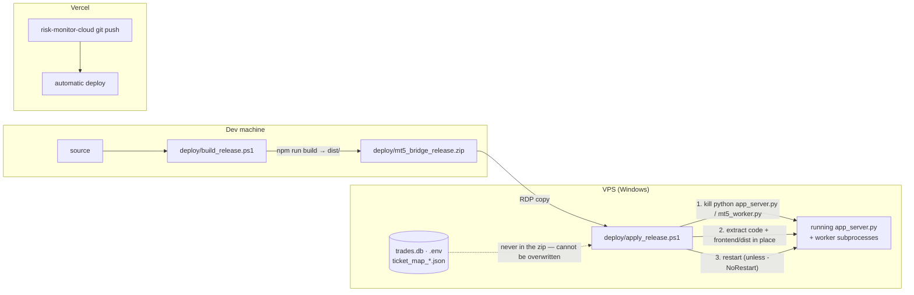

**`build_release.ps1`** (dev machine) runs `npm run build`, then stages `app_server.py`, `mt5_worker.py`, `news_calendar.py`, `cloud_sync.py`, `copier_monitor.py`, `issue_log.py`, `signal_alert.wav`, `requirements.txt` plus `frontend/dist`.

**Deliberately excluded from the zip:** `trades.db`, `.env`, `ticket_map_*.json`, `__pycache__`, `node_modules`, `test_*.py`, `static/`, `templates/`, `fix_*.py`, `scratch.py`. The VPS's live state is therefore *physically incapable* of being overwritten by a release.

**`apply_release.ps1`** (VPS) finds python processes whose command line matches `app_server\.py|mt5_worker\.py`, kills them, extracts, and restarts. Schema changes apply themselves on the next start because `init_db()` is idempotent (`CREATE TABLE IF NOT EXISTS` + guarded `ALTER TABLE ADD COLUMN`) against the *existing* `trades.db`.

The two repos have **separate git histories** and deploy independently.

---

## 20. Design invariants & failure modes

### Invariants — break these and something silently goes wrong

1. **Positional SELECT tuples must stay stable.** Every fallback tier of a cascading `try/except OperationalError` SELECT must be updated together, or you get a column-count mismatch at runtime.
2. **Nothing user-authored may key on `trading_log.id`** — resync rebuilds those rows. Use `(instance_id, position_id)`.
3. **`issue_log` has exactly one writer** (`app_server.py`). Workers must report over HTTP, never touch the file.
4. **Reporting must never break copying.** All worker → server reporting is fire-and-forget on a daemon thread with a 3 s timeout, wrapped so it can't raise into the trading loop.
5. **`lib/syncTypes.ts` mirrors `build_sync_payload()`.** Change both or ingestion breaks.
6. **`npm run build` before deploying frontend changes.** Flask serves `dist/`, not source.
7. **The cloud is a full-snapshot target.** Never write to those tables from anywhere else; the next sync truncates them.

### Failure modes and how the system handles them

| Failure | Detection | Response |
|---|---|---|
| MT5 terminal offline | `mt5.initialize(path=…)` returns falsy → instance absent from payload | `n/N Online` status, connection-loss Telegram alert |
| Consumer worker crashes | `copier_manager_thread` sees `process.poll() is not None` while still desired | Respawn + `report_worker_restart()` with a 6-line log tail |
| Consumer loses ZMQ subscription silently | Reconciler set-difference after `COPY_GRACE_SEC` | CRITICAL incident + Telegram with RETRY/CLOSE buttons |
| Broker rejects an order | `order_send` retcode | Retry up to 3× on transient codes; otherwise report with `RETCODES[code]` name + plain-English cause |
| Provider goes flat, mirror still open | Reconciler after `CLOSE_GRACE_SEC` | Orphaned-mirror incident + CLOSE button |
| One consumer failing everything | `STORM_LIMIT` 5 CRITICALs / 60 s | Collapse into a single storm alert |
| News feed unreachable | 3 fetch attempts fail | **Fail closed**: PROPFIRM instances blocked from all copying + Telegram asking for manual entry |
| Drawdown level crossed | Poller vs `alert_drawdown_levels` | Telegram alert per level |
| Profit ceiling hit | Poller vs `alert_profit_ceiling_usd` | Auto-close positions, set `trade_locked = 1` (manual unlock required) |
| Profit lock approaching | Poller vs `alert_profit_lock_pct` | Telegram with an ARM inline button; armed state auto-closes on target |
| Tab backgrounded for hours | Socket backlog | rAF coalescing + visibility disconnect |
| Cloud sync fails | `sync_to_cloud()` returns `(False, msg)` | Recorded in `global_settings.last_cloud_sync_*`; exit code 1 for Task Scheduler |
| Partial cloud ingestion | Exception mid-transaction | `ROLLBACK`, 500 with the message; previous snapshot intact |
| `trading_log` drifts from broker truth | `reconcile_journal.py` (manual) | Non-zero exit + per-position diff |

---

## 21. Legacy / dead code & known drift

Things that exist in the tree but are **not** part of the running system — documented so they aren't mistaken for architecture.

| Item | Status |
|---|---|
| `how_this_works.md`, `installation_guide.md` (repo root) | Describe an older TradingView-webhook workflow (`app.py`, `/webhook`, `indicator.pine`) that no longer exists. Historical/aspirational only. |
| `fix_tabs.py`, `fix_ui_freezes.py` (repo root) | One-off patch scripts run once against the legacy jQuery frontend. |
| `mt5_bridge/static/*.js`, `mt5_bridge/templates/*.html` | Dead legacy jQuery frontend, fully superseded by the React app. Excluded from the release zip. |
| `mt5_bridge/fix_db.py`, `fix_main.py`, `scratch.py`, `temp_time.py` | One-off/scratch scripts. |
| `test.bat` | References `test_webhook.py`, which no longer exists. |
| `/api/backtest/sessions`, `/api/backtest/trades` | Routes exist and query `backtest_sessions` / `backtest_trades`, but **no `CREATE TABLE` for either exists anywhere** and neither is in the live DB. These endpoints will raise on use; the React frontend never calls them. |
| `prop_firms`, `prop_firm_rules`, `prop_firm_rule_proposals` tables | Present in the live `trades.db` but **no longer referenced anywhere in the Python source** — orphaned from an earlier iteration. |
| `POST /api/cloud_sync` + Settings "Sync Now" button | Described in `cloud_sync.py`'s docstring and implied by the `last_cloud_sync_*` columns, but **the route does not exist**. Only CLI + Task Scheduler trigger a sync today. |
| `instances.auto_trade`, `accepted_timeframe` | Columns survive from the webhook era; not used by the copier path. |
| Checked-in `trades.db` vs current code | The committed DB predates the copier-ledger tables (`copier_signals`, `copier_executions`, `copier_incidents`). `init_db()` → `copier_monitor.init_schema()` creates them on the next start; they are simply absent until then. |
| Line count vs `CLAUDE.md` | `CLAUDE.md` describes `app_server.py` as "~1800 lines" and lists three frontend routes (`/`, `/copier`, `/review`). It is now **4,844 lines** with five routes (`/`, `/copier`, `/portfolio`, `/portfolio/:id`, `/settings`); `Review.tsx` still exists as a file but is no longer routed. |

---

## Appendix — file inventory

### risk_monitor

```
risk_monitor/
├── CLAUDE.md
├── how_this_works.md                # legacy
├── installation_guide.md            # legacy
├── fix_tabs.py, fix_ui_freezes.py   # legacy one-offs
├── docs/
│   ├── ARCHITECTURE.md              # this file
│   └── trading-journal-plan.md
└── mt5_bridge/
    ├── app_server.py            # 4,844 — Flask, Socket.IO, 7 threads, init_db, all routes
    ├── mt5_worker.py            #   745 — PROVIDER/CONSUMER copier subprocess
    ├── copier_monitor.py        # 1,171 — ledger + reconciler + incident engine
    ├── issue_log.py             #   261 — append-only human issue log
    ├── news_calendar.py         #   184 — blackout logic + feed fetch
    ├── cloud_sync.py            #   171 — redacted snapshot → HTTPS
    ├── reconcile_journal.py     #   234 — offline journal acceptance test
    ├── requirements.txt, run.bat, .env
    ├── trades.db                # SQLite source of truth (tracked)
    ├── news_windows.json, signal_alert.wav
    ├── deploy/
    │   ├── build_release.ps1    # dev: npm build + stage + zip
    │   ├── apply_release.ps1    # VPS: stop, extract, restart
    │   ├── check_open_positions.py
    │   └── mt5_bridge_release.zip
    ├── frontend/                # Vite + React 19 + TS
    │   └── src/
    │       ├── App.tsx, main.tsx, types.ts
    │       ├── hooks/useSocket.ts
    │       ├── store/useStore.ts
    │       ├── theme/{ThemeProvider,PhosphorPicker,phosphors,themeContext}
    │       ├── components/shell/{CommandBar,Sidebar,StatusLine,Page,nav}
    │       ├── components/{Dashboard,Copier,CopierHealth,InstancesOverview,
    │       │              TrackerTable,PortfolioManagement,Settings,NewsPanel,
    │       │              TradeModal,FlashCell,Review*}
    │       ├── components/journal/{Journal,VerdictBar,EquityUnderwater,
    │       │                       CalendarHeatmap,Breakdowns,TradeLog,format}
    │       └── components/ui/Terminal.tsx
    ├── static/, templates/      # dead legacy jQuery frontend
    ├── test_*.py                # standalone manual debug scripts
    └── logs/                    # worker_<id>.log, issues_<date>.txt
```

`* Review.tsx` exists but is no longer reachable from the router.

### risk-monitor-cloud

```
risk-monitor-cloud/
├── README.md, PROGRESS.md, AGENTS.md, CLAUDE.md
├── schema.sql                   # Postgres DDL — apply once
├── next.config.ts, tsconfig.json, eslint.config.mjs
├── .env.example, .env.local
├── app/
│   ├── layout.tsx, globals.css, page.tsx
│   ├── accounts/[id]/page.tsx
│   └── api/sync/route.ts        # POST ingestion (bearer + transaction)
├── lib/
│   ├── db.ts, queries.ts, syncTypes.ts
│   ├── metrics.ts               # all derived math, pure
│   └── simulation.ts, chart-domain.ts, format.ts, use-mounted.ts
├── providers/theme.tsx
└── components/
    ├── app/{app-shell,page-header,status-tag,term-button,meter,
    │        nav-row,live-clock,phosphor-picker}.tsx
    ├── AccountCard, AccountAnalytics, InfoPanel, StatRow
    ├── AdvancedStatsPanel, RiskOfRuinTable, GrowthPanel
    ├── MonthStatsPanel, MonthlyReturnsPanel, LongShortCards
    ├── TimeSeriesChart, DrawdownChart, MonthlyReturnsChart,
    │   DivergingBarChart, DurationChart
    └── TradingCalendar, TradeHistoryTable, SimulationBar
```
